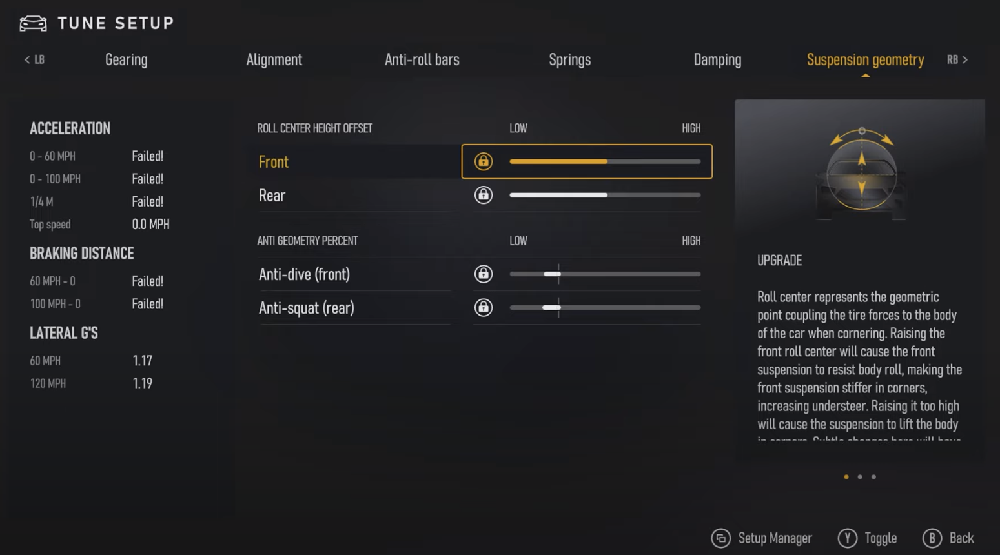
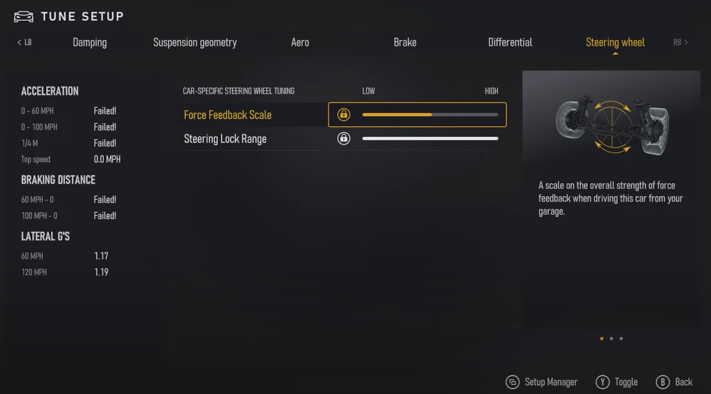
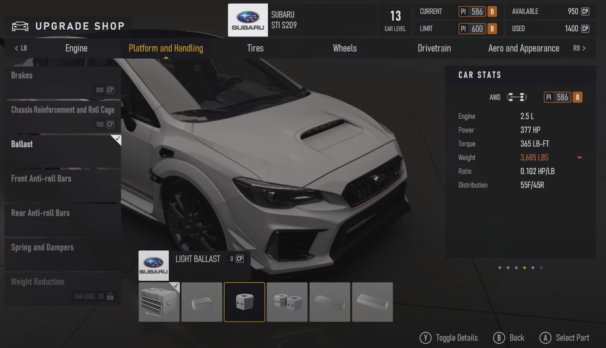

# ForzaOpenTuneFormatter

Website for formatting Forza Horizon tuning builds for open source sharing on reddit (r/ForzaOpenTunes)

## Links used in creating Tune Calculator

- [Diqque's Tuning Spreadsheet](https://onedrive.live.com/edit.aspx?cid=e7950f567151b185&page=view&resid=E7950F567151B185!358927&parId=E7950F567151B185!121&app=Excel&wacqt=search)
- [FHSusp Spreadsheet](https://docs.google.com/spreadsheets/d/17_guIkTx2tiS5JIQRB_lTjZeU8n9paEgl_2h7XT20ng/edit#gid=1664634996)
- [Forza Toolbox](https://docs.google.com/spreadsheets/d/13Rlir36-ODaF4v2qGUR7WwF5LPMFHnBiHfglNpCKIsc/edit#gid=797012139) - [Original](<https://docs.google.com/spreadsheets/d/1X-c0bLiuUN_QR5urpQs4fewS0B-iWydSHAjgMozkhJk/edit#gid=1023796684>) - [Originally Found Here](https://forums.forzamotorsport.net/t/ride-frequency-tuning-calculator/91481)
- [Suspension Calculator](https://docs.google.com/spreadsheets/d/1X-c0bLiuUN_QR5urpQs4fewS0B-iWydSHAjgMozkhJk/edit#gid=1023796684) - [Original](http://www.usrallyteam.com/content/tech/suspension_calculator.xls) - [Originally Found Here](http://www.tracktuned.com/feed/2016/11/27/overspring-spring-frequency)
- [Project Cars 2 Suspension Calculator](https://docs.google.com/spreadsheets/d/1TP7_in8cOQWwM3KeNcQ_mMW-DFIpDKNzNZXS-au4BXM/edit#gid=1812832385)
- [Forza Forums - Basic formula for spring rate?](https://forums.forzamotorsport.net/t/basic-formula-for-spring-rate/537503/9)
- [Suspension Secrets - Dampers](https://suspensionsecrets.co.uk/dampers/)
- [Hypercoils.com Spring Rate Calculator](https://www.hypercoils.com/spring-rate-calculator/)
- A huge resource: [OptimumG Tech Papers](https://optimumg.com/category/technical-papers/tech-tips/)

## TODO

- [x] Completely remove the brand and car lists. Instead add open text boxes so people type their car manually. This way you won't have to update the formatter every time they add content.
- [ ] Add a toggle to switch between FM8, Forza Horizon 5 and "other"(for previous games).
- [ ] New banner/picture to better represent both FM and FH (After FM comes out)

### Homepage

- [ ] Add a word that we support both the Horizon and Motorsport sides of the franchise.
- [ ] Add sections about video guides and the soon to be released Tuning Academy

### Tuning

- [ ] Add Suspension Geometry 
  - [ ] Roll Center Height Offset (Low/High): Front and Rear
  - [ ] Anti-geometry Percent: Anti-dive (front) and Anti-dive (rear)
- [ ] Car-Specific Steering Wheel Tuning 
  - [ ] Force Feedback Scale
  - [ ] Steering Lock Range

### Upgrades

- [ ] Ballast: Add ballast in increments of 2.5%, from 0% to 12.5% 
